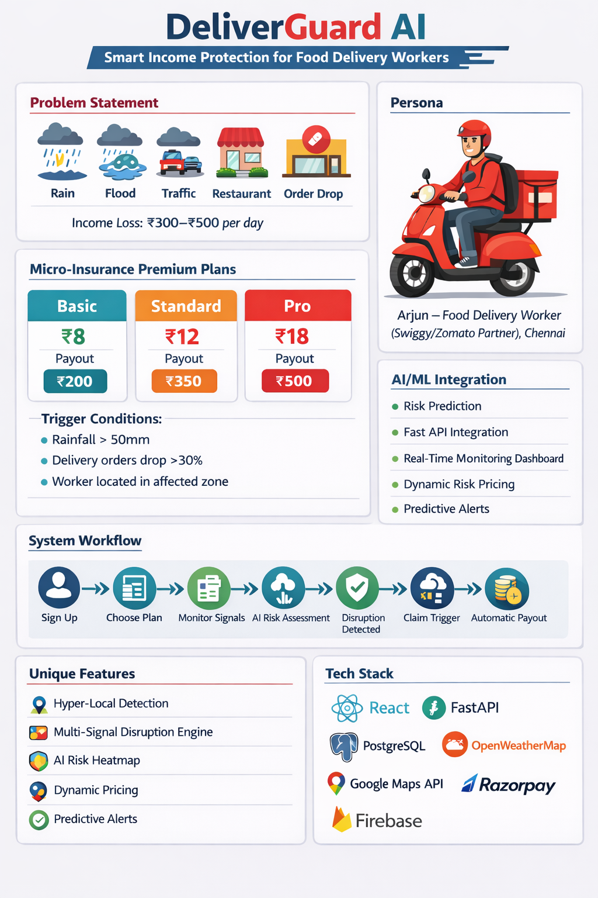
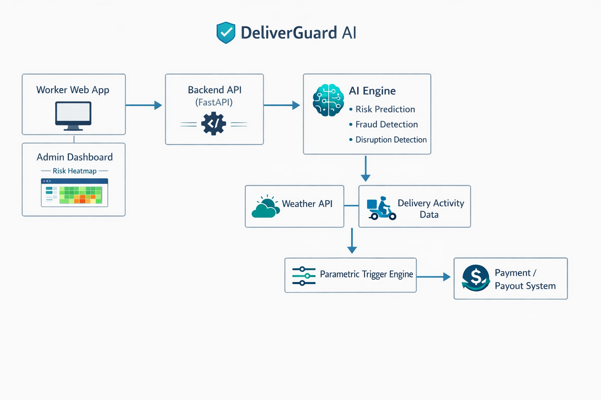

# DeliverGuard AI
### Smart Income Protection for Delivery Workers

DeliverGuard AI is an **AI‑powered parametric micro‑insurance platform** designed to protect delivery workers from **income loss caused by delivery disruptions**.

These disruptions can include **heavy rain, floods, extreme weather, traffic congestion, restaurant closures, or sudden drops in delivery demand**.

Instead of requiring workers to manually submit claims, DeliverGuard AI automatically **detects disruptions using real‑time data signals and triggers instant compensation payouts**.

---

# Visual Overview

<p align="center">

</p>

---

# Problem Understanding

Gig economy workers such as **food delivery partners** depend entirely on daily deliveries for their income.

Platforms such as:

- Swiggy
- Zomato
- Dunzo
- Blinkit

have thousands of delivery partners working every day.

However, these workers operate in **unpredictable environments** where external disruptions can suddenly reduce delivery activity.

Common disruptions include:

- Heavy rainfall
- Flooded roads
- Extreme heat
- Traffic congestion
- Restaurant closures
- Sudden drop in delivery demand

During such disruptions, delivery workers may lose **₹300–₹500 of daily income**.

Currently, traditional insurance products **do not cover short‑term income disruption for gig workers**, leaving them financially vulnerable.

DeliverGuard AI addresses this problem by providing **automated micro‑insurance designed specifically for delivery workers**.

---

# Delivery Worker Persona

### Persona Example

**Name:** Arjun  
**Age:** 27  
**Occupation:** Swiggy Delivery Partner  
**City:** Chennai  

<p align="center">

</p>

### Daily Work

- Works around 8 hours per day
- Completes 18–25 deliveries
- Earns ₹900–₹1200 per day

### Disruption Scenario

During heavy rain:

- Delivery demand drops significantly
- Restaurants close temporarily
- Roads become difficult to navigate

Arjun may lose **3–4 hours of work**, resulting in **₹300–₹500 income loss**.

DeliverGuard AI protects workers like Arjun by providing **automatic financial compensation during disruptions**.

---

# Weekly Premium Model

DeliverGuard AI provides **micro‑insurance policies with weekly coverage**.

### Example Insurance Plan

Weekly Premium: **₹12**

Coverage Duration: **7 Days**

### Claim Trigger Conditions

1. Delivery disruption detected in worker zone
2. Delivery activity drops **more than 30%**
3. Worker location verified in affected area

### Payout Amount

**₹350**

This helps workers recover **temporary income loss caused by disruptions**.

---

# Parametric Insurance Model

DeliverGuard AI uses a **parametric insurance system**.

Instead of workers submitting manual claims, payouts are triggered automatically when predefined disruption conditions occur.

### Disruption Detection Signals

**Weather Signals**

- heavy rain
- flooding
- extreme weather

**Delivery Activity Signals**

- sudden drop in orders
- restaurant closures
- traffic congestion

**Location Verification**

- worker GPS confirms presence in affected zone

When disruption thresholds are crossed → **automatic payout triggered**.

This makes the system:

- fast
- transparent
- efficient

---

# AI / ML Integration

Artificial Intelligence powers several components of DeliverGuard AI.

---

## Disruption Detection Engine

AI analyzes multiple signals:

- weather intensity
- order activity drop
- traffic conditions

This enables **accurate disruption detection**.

---

## Risk Prediction Model

AI analyzes historical data such as:

- rainfall patterns
- disruption frequency
- delivery demand trends

This helps determine **risk levels for different delivery zones**.

---

## Fraud Detection System

AI verifies claims using:

- worker GPS location
- weather data
- delivery activity patterns

This prevents fraudulent claims such as:

- fake disruption claims
- location spoofing
- repeated claims abuse

---

# Platform Choice

The prototype will initially be built as a **Web Platform**.

Reasons:

- Faster development during hackathon
- Easy integration with APIs
- Accessible across devices

Future versions may include **mobile applications for delivery workers**.

---

# System Workflow

1. Worker registers on DeliverGuard platform  
2. Worker purchases weekly insurance coverage  
3. System continuously monitors disruption signals  
4. Delivery disruption detected in worker zone  
5. Delivery activity drops significantly  
6. AI verifies disruption  
7. Insurance claim automatically triggered  
8. Payout sent instantly to worker  

<p align="center">

</p>

---

# System Architecture

DeliverGuard AI consists of multiple system components:

Worker Application  
↓  
Insurance Platform Backend  
↓  
AI Risk Engine  
↓  
Disruption Detection Engine  
↓  
Weather API + Delivery Data  
↓  
Claim Trigger System  
↓  
Payment Gateway  
↓  
Worker Receives Payout

---

# Technology Stack

### Frontend
React.js

### Backend
Python FastAPI

### Database
PostgreSQL

### AI / ML
Python (Scikit‑learn)

---

# External APIs Used

DeliverGuard AI relies on several external APIs to detect disruptions and process insurance triggers.

### Weather Data API
Used to monitor real‑time weather conditions such as rainfall and extreme weather.

Example:
- OpenWeatherMap API

Purpose:
- Detect heavy rain
- Identify weather disruptions
- Trigger parametric insurance payouts

---

### Maps & Location API
Used to verify worker location and determine affected delivery zones.

Example:
- Google Maps API

Purpose:
- Verify worker GPS location
- Identify disruption zones
- Map delivery areas

---

### Traffic Data API (Optional)
Used to detect road congestion or traffic disruptions affecting deliveries.

Example:
- Google Maps Traffic API

Purpose:
- Detect delivery slowdowns caused by traffic

---

### Payment API
Used to simulate automatic insurance payouts.

Example:
- Razorpay API (Sandbox)

Purpose:
- Process compensation payments to workers

---

### Notification API (Optional)
Used to send disruption alerts and payout notifications.

Examples:
- Firebase Cloud Messaging
- Twilio SMS API

Purpose:
- Notify workers about disruptions
- Send payout alerts

---

# Unique Features

## Multi‑Disruption Detection

The platform supports **multiple delivery disruptions**, including:

- heavy rain
- floods
- extreme weather
- traffic congestion
- restaurant closures
- sudden drop in delivery demand

---

## Hyper‑Local Disruption Monitoring

Disruptions are detected at **delivery zone level instead of city level**, improving accuracy and fairness.

---

## Dynamic Risk Pricing

Premiums can adjust based on **risk level of different locations**.

Example:

Low Risk Zone → ₹8/week  
Medium Risk Zone → ₹12/week  
High Risk Zone → ₹16/week  

---

## Predictive Disruption Alerts

AI models analyze weather forecasts and delivery patterns to **predict potential disruptions before they occur**.

Workers may receive alerts such as:

"Heavy rainfall expected in your delivery zone within 2 hours."

---

## AI Risk Heatmap

Admin dashboard visualizes **high‑risk zones across the city** using disruption risk maps.

---

# Demo Scenario

Example scenario:

1. Delivery worker purchases **₹12 weekly insurance**
2. Heavy rainfall occurs in Chennai
3. Delivery orders drop by **30%**
4. DeliverGuard AI detects disruption
5. AI verifies worker location and activity data
6. Insurance payout **₹350 automatically triggered**
7. Worker receives compensation instantly

---

# 45‑Day Development Roadmap

### Phase 1 – Ideation & Planning
- problem research
- gig worker persona analysis
- insurance model design
- architecture planning
- documentation and repository setup

### Phase 2 – Platform Development
- worker onboarding system
- insurance policy management
- weather API integration
- disruption detection logic

### Phase 3 – AI & Automation
- risk prediction model
- fraud detection system
- disruption prediction engine
- automated payout system

---

# Expected Impact

DeliverGuard AI improves **financial resilience for gig workers** by protecting them from sudden income loss caused by delivery disruptions.

The platform can eventually expand to support:

- multiple cities
- grocery delivery workers
- courier services
- e‑commerce delivery partners

creating a scalable **gig‑economy insurance platform**.

---

# Strategy Video

A **2‑minute strategy video** explaining the idea, architecture, and execution plan will be uploaded and shared during submission.

---

# Hackathon

Project developed for the **Guidewire DEVTrails Pan‑India Hackathon**.

---

# Repository

```
DeliverGuard-AI-Smart-Income-Protection-for-Delivery-Workers
```

This repository will be used throughout **all phases of development during the hackathon**.
