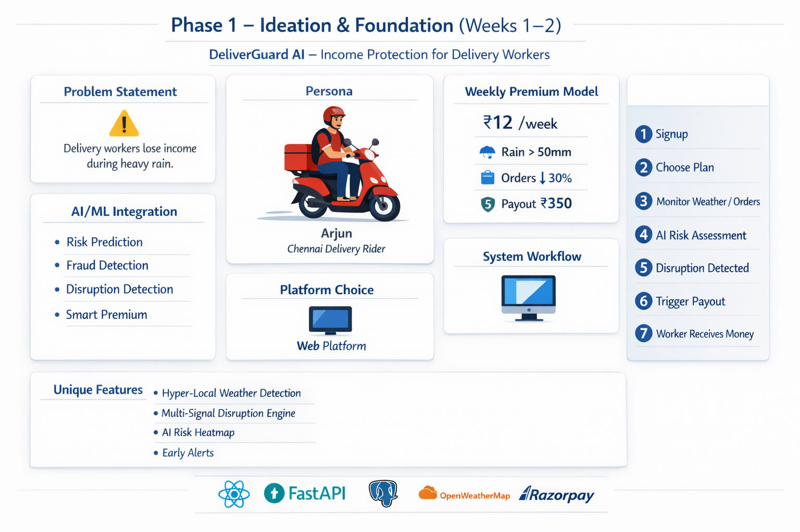

# DeliverGuard AI
### Smart Income Protection for Delivery Workers

DeliverGuard AI is a **parametric micro‑insurance platform** that automatically compensates delivery workers when disruptions such as heavy rain reduce their income.

<br><br>

DeliverGuard AI supports multiple delivery disruptions including heavy rain, floods, extreme weather, traffic disruptions, and sudden drops in delivery demand.
---

## Visual Overview

<p align="center">

</p>

---

# Overview

DeliverGuard AI is an **AI‑powered parametric insurance platform** designed to protect **food delivery workers from income loss caused by weather disruptions** such as heavy rainfall.

Food delivery partners working for platforms like **Swiggy and Zomato** rely on daily deliveries to earn income. External disruptions like **heavy rain, flooding, or extreme weather conditions** can drastically reduce delivery activity, resulting in immediate income loss.

DeliverGuard AI automatically detects such disruptions using **weather intelligence and delivery activity signals** and triggers **instant insurance payouts without requiring manual claims**.

---

# Problem Statement

Gig economy workers operate in highly unpredictable environments.

In cities like **Chennai**, heavy rainfall frequently causes:

- Flooded roads
- Restaurant closures
- Reduced delivery orders
- Unsafe driving conditions

During such disruptions, delivery workers may lose **₹300–₹500 of daily income**.

Currently, traditional insurance products **do not cover short‑term income disruption for gig workers**, leaving them financially vulnerable.

DeliverGuard AI addresses this problem by providing **automated micro‑insurance designed specifically for delivery workers**.

---

# Delivery Worker Persona

### Persona Example

**Name:** Arjun  
**Age:** 27  
**Occupation:** Swiggy Delivery Partner  
**City:** Chennai

<p align="center">

</p>

### Daily Work

- Works around 8 hours per day
- Completes 18–25 deliveries
- Earns ₹900–₹1200 per day

### Disruption Scenario

During heavy rain:

- Delivery demand drops significantly
- Restaurants close temporarily
- Roads become difficult to navigate

Arjun may lose **3–4 hours of work**, resulting in **₹300–₹500 income loss**.

DeliverGuard AI protects workers like Arjun by providing **automatic financial compensation during disruptions**.

---

# Weekly Premium Model

DeliverGuard AI provides **micro‑insurance policies with weekly coverage**.

### Example Insurance Plan

Weekly Premium: **₹12**

Coverage Duration: **7 Days**

### Claim Trigger Conditions

1. Rainfall greater than **50mm in the delivery zone**
2. Delivery order activity drops **more than 30%**

### Payout Amount

**₹350**

This helps workers recover **temporary income loss caused by environmental disruptions**.

---

# Parametric Insurance Trigger

DeliverGuard AI uses a **parametric insurance model**.

Instead of workers submitting manual claims, payouts are triggered automatically when predefined conditions occur.

### Trigger Signals

**Weather Trigger**

Heavy rainfall detected using weather APIs.

**Economic Trigger**

Delivery order activity drops significantly.

When both signals occur → **automatic payout is triggered**.

This makes the system **fast, transparent, and efficient**.

---

# AI / ML Integration

Artificial Intelligence powers multiple components of DeliverGuard AI.

## Risk Prediction Model

AI analyzes historical data such as:

- rainfall patterns
- flood‑prone zones
- delivery demand trends

This helps determine **risk scores for different delivery zones** and enables dynamic premium pricing.

---

## Fraud Detection System

AI verifies claims using:

- worker GPS location
- weather data
- delivery activity patterns

This prevents fraudulent claims such as **location spoofing or duplicate claims**.

---

## Disruption Detection Engine

AI analyzes multiple signals including:

- rainfall intensity
- order activity drop
- traffic congestion

This ensures **accurate disruption detection**.

---

# Platform Choice

The prototype will initially be built as a **Web Platform**.

### Reasons

- Faster development during hackathon
- Easy API integration
- Accessible across devices

Future versions may include **mobile applications for delivery workers**.

---

# System Workflow

1. Worker registers on the platform  
2. Worker purchases weekly insurance coverage  
3. System continuously monitors weather data  
4. Heavy rainfall detected in worker delivery zone  
5. Delivery order activity drops significantly  
6. AI verifies disruption  
7. Insurance claim automatically triggered  
8. Payout sent instantly to worker  

<p align="center">

</p>

---

# System Architecture

The DeliverGuard AI system consists of several components:

Worker App  
↓  
Insurance Platform Backend  
↓  
AI Risk Engine  
↓  
Weather API & Delivery Data  
↓  
Disruption Detection Engine  
↓  
Claim Trigger System  
↓  
Payment Gateway  
↓  
Worker Receives Payout

---

# Technology Stack

### Frontend
React.js

### Backend
Python FastAPI

### Database
PostgreSQL

### AI / ML
Python (Scikit‑learn)

### External APIs

OpenWeatherMap – Weather Data  
Google Maps API – Location Services

### Payments

Razorpay Sandbox / Mock UPI

### Hosting

AWS / Render / Vercel

---

# Unique Features

## Hyper‑Local Weather Detection

Insurance triggers are calculated at **delivery zone level instead of city level**, improving fairness and accuracy.

---

## Multi‑Signal Disruption Engine

The system verifies disruptions using multiple signals:

- rainfall data
- delivery order activity
- traffic conditions

---

## AI Risk Heatmap

Admin dashboard visualizes **high‑risk zones in the city** using an AI‑generated disruption risk map.

---

## Smart Premium Calculator

Premiums dynamically adjust based on:

- weather history
- disruption frequency
- delivery density

---

## Early Disruption Alerts

Workers receive predictive alerts such as:

> "Heavy rain expected in your zone within 2 hours."

This helps workers **prepare for potential disruptions**.

---

# Demo Scenario

Example workflow:

1. Delivery worker purchases **₹12 weekly insurance**
2. Heavy rainfall occurs in Chennai
3. Delivery orders drop by **more than 30%**
4. DeliverGuard AI detects disruption
5. Insurance payout **₹350 automatically triggered**
6. Worker receives compensation instantly

---

# Development Plan

## Phase 1 – Ideation & Foundation

- Problem research
- Persona analysis
- Insurance model design
- Architecture planning

---

## Phase 2 – Platform Development

- Worker onboarding
- Insurance policy management
- Weather monitoring integration

---

## Phase 3 – Intelligence & Automation

- AI risk prediction
- Fraud detection
- Automated payout system

---

# Expected Impact

DeliverGuard AI improves **financial resilience for gig workers** by protecting them from sudden income loss caused by environmental disruptions.

The platform can expand to support:

- multiple cities
- grocery delivery workers
- e‑commerce delivery partners

creating a scalable **gig‑economy insurance platform**.

---

# Repository

```
DeliverGuard-AI-Smart-Income-Protection-for-Delivery-Workers
```

This repository will be used throughout **all phases of the hackathon development**.

---

# Strategy Video

A **2‑minute strategy video** explaining the idea, architecture, and execution plan will be uploaded and shared during submission.

---

# Hackathon

Project developed for **Guidewire DEVTrails Pan‑India Hackathon**.
